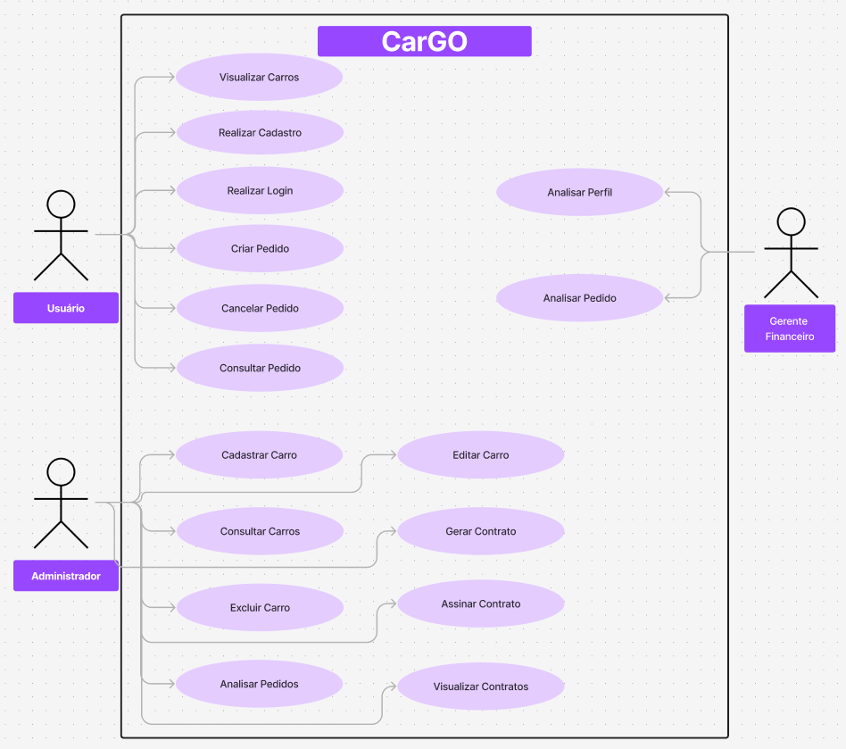

# CarGo

O **CarGo** é uma plataforma web projetada para gerenciar o processo de aluguel de automóveis de forma eficiente e segura. O sistema permite que usuários individuais e agentes realizem diversas operações relacionadas aos aluguéis de veículos, incluindo pedidos, cancelamentos e modificações.

## Funcionalidades Principais

### Usuário 

1. **Cadastro:** 
   - Registro de novo usuário, armazenando informações pessoais (Nome, RG, CPF, Endereço, Profissão) 
   
2. **Login:** 
   - Autenticação de usuários por meio de credenciais (nome de usuário e senha).
   
3. **Criar Pedido de Aluguel:** 
   - Permitir ao cliente selecionar um veículo, especificar as datas de aluguel e enviar o pedido.
   
4. **Modificar Pedido:** 
   - Permitir ajustes em pedidos ainda não confirmados, como alteração de datas ou veículo.
   
5. **Consultar Pedido:** 
   - Visualizar o status do pedido (pendente, aprovado, cancelado, concluído).
   
6. **Cancelar Pedido:** 
   - Permitir ao usuário cancelar pedidos que não deseja mais realizar.

---

### Administrador 
1. **Analisar Pedido:** 
   - Avaliar a viabilidade do contrato considerando os requisitos do pedido.
   
2. **Modificar Pedido:** 
   - Realizar ajustes em pedidos pendentes, especialmente para adequação contratual.
   
3. **Conceder Contrato:** 
   - Formalizar pedidos aprovados e garantir que o aluguel será realizado.

4. **Cadastrar Automóvel:**
    - Realizar o cadastro dos automóveis utilizando todos os dados do mesmo. 

5. **Editar os Automóveis**
    - Realizar a edição dos dados dos automóveis e seus respectivos dados.

---

### Gerente Financeiro 

1. **Analisar Pedido:** 
    - Avaliar a capacidade financeira do cliente para a concessão de crédito.
    
2. **Conceder Crédito:** 
    - Autorizar a formalização de contratos de aluguel que dependam de financiamento.
    
2. **Analisar Pedido:** 
    - Faz a analise ao final do pedido. 

---

## Histórias de Usuário - CarGO

| ID  | Ator      | História de Usuário                                                                                                      |
| --- | --------- | ------------------------------------------------------------------------------------------------------------------------ |
| 1   | Cliente   | Como cliente, quero me cadastrar no sistema para poder acessar as funcionalidades de aluguel de automóveis.             |
| 2   | Cliente   | Como cliente, quero realizar login no sistema para acessar minha conta e gerenciar meus pedidos de aluguel.             |
| 3   | Cliente   | Como cliente, quero criar um pedido de aluguel de automóvel para escolher o veículo que desejo alugar.                  |
| 4   | Cliente   | Como cliente, quero modificar um pedido de aluguel que eu tenha realizado para atualizar informações, como datas ou veículo escolhido. |
| 5   | Cliente   | Como cliente, quero consultar o status dos meus pedidos de aluguel para acompanhar o andamento do processo.            |
| 6   | Cliente   | Como cliente, quero cancelar um pedido de aluguel que eu não pretendo mais realizar.                                      |
| 7   | Empresa   | Como empresa, quero analisar pedidos de aluguel para avaliar a viabilidade do contrato.                                   |
| 8   | Empresa   | Como empresa, quero modificar pedidos de aluguel que estejam pendentes para ajustar condições contratuais.              |
| 9   | Empresa   | Como empresa, quero conceder contratos para formalizar os pedidos aprovados e garantir que o aluguel será realizado.     |
| 10  | Banco     | Como banco, quero analisar pedidos de aluguel para verificar a viabilidade financeira e aprovar o crédito necessário.    |
| 11  | Banco     | Como banco, quero conceder crédito para formalizar contratos de aluguel que dependam de financiamento.                  |
| 12  | Usuário   | Como usuário, quero registrar um automóvel no sistema para que ele possa ser alugado.                                     |
| 13  | Usuário   | Como usuário, quero consultar os automóveis disponíveis para verificar as opções que posso alugar.                      |
| 14  | Usuário   | Como usuário, quero gerar contratos para formalizar os pedidos aprovados e garantir a validade legal do aluguel.         |
| 15  | Admin     | Como administrador, quero construir páginas dinâmicas para personalizar a interface e melhorar a experiência do usuário. |

## Diagrama de Caso de uso

## Diagrama de Classes 

## Diagrama de Pacotes 

## Requisitos do Sistema

### Cadastro de Usuários
- O sistema exige um **cadastro prévio** para qualquer operação.
- Clientes devem fornecer informações como **RG, CPF, Nome, Endereço, Profissão, Entidade Empregadora e Renda (até 3 registros)**.

### Gerenciamento de Automóveis
- Registro de informações sobre os veículos, incluindo **matrícula, ano, marca, modelo e placa**.
- Associação do automóvel a contratos de aluguel.

### Contratos e Análise Financeira
- O aluguel pode estar vinculado a um **contrato de crédito** fornecido por um banco agente.
- Somente pedidos com parecer financeiro positivo podem ser finalizados.

### Infraestrutura do Sistema
- Servidor central conectado às máquinas locais dos clientes e agentes.
- Todas as transações e interações são realizadas via **Internet**.

## Tecnologias Utilizadas

| Tecnologia | Descrição |
|------------|-------------|
| **Backend** | Java (Spring Boot)  |
| **Frontend** | HTML5 |
| **Banco de Dados** | PostgreSQL L |
| **Autenticação** | JWT |
| **Infraestrutura** | Servidores em Cloud (AWS, Azure ou Google Cloud) |